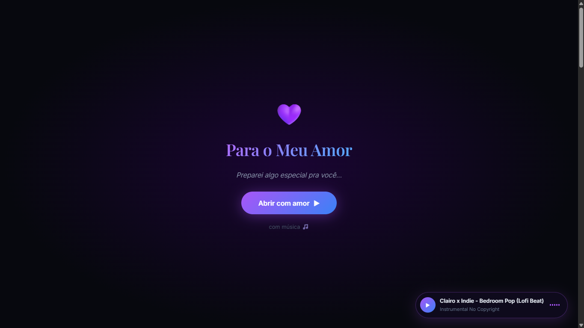
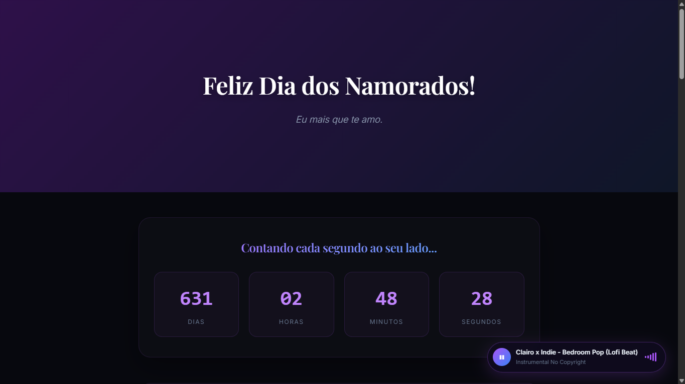
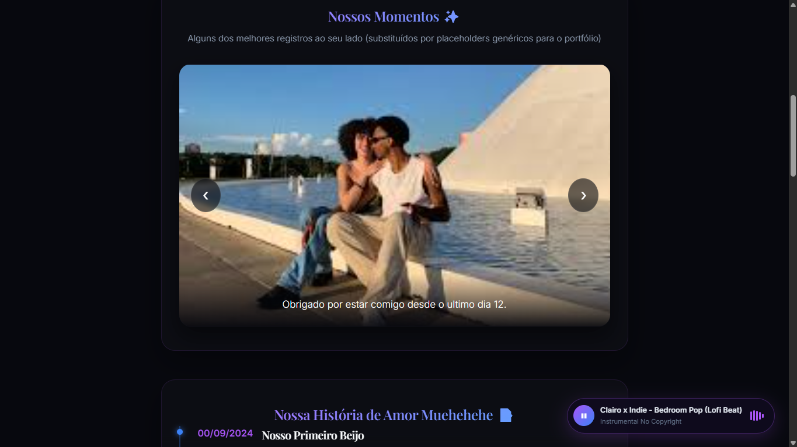
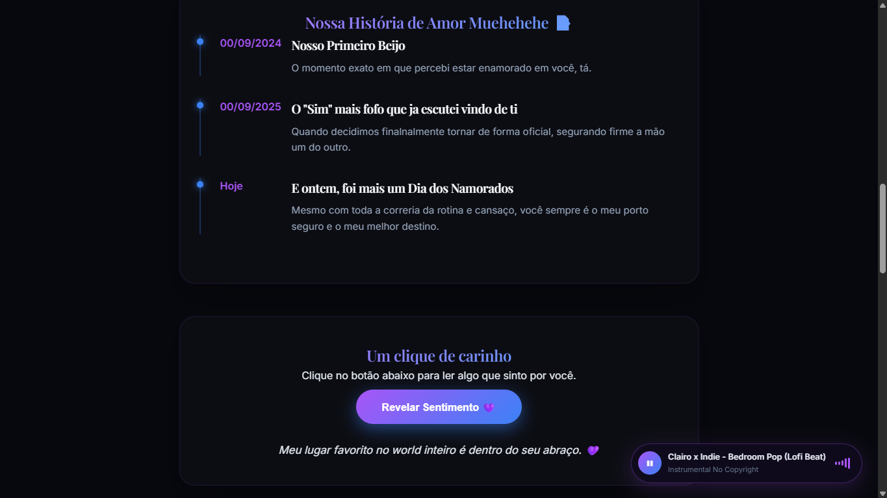
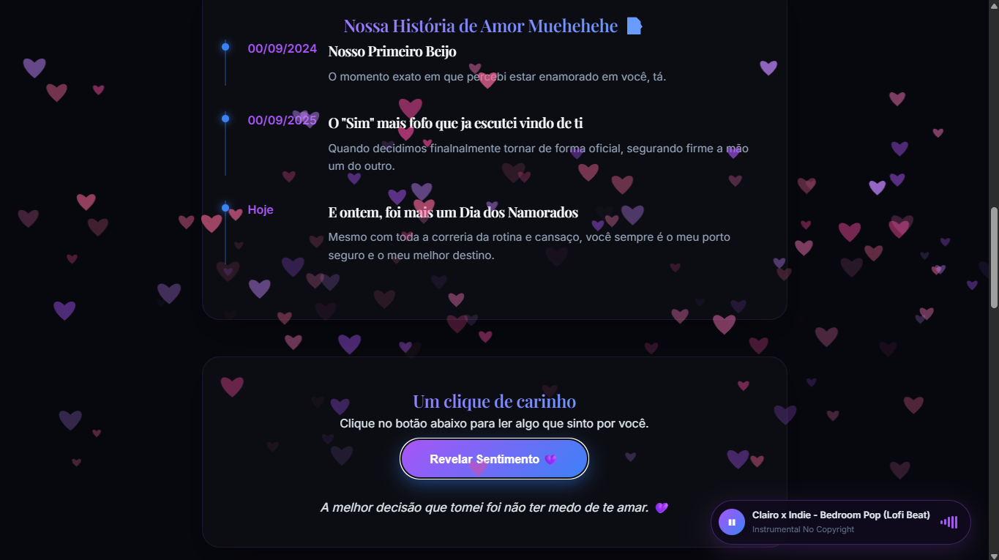
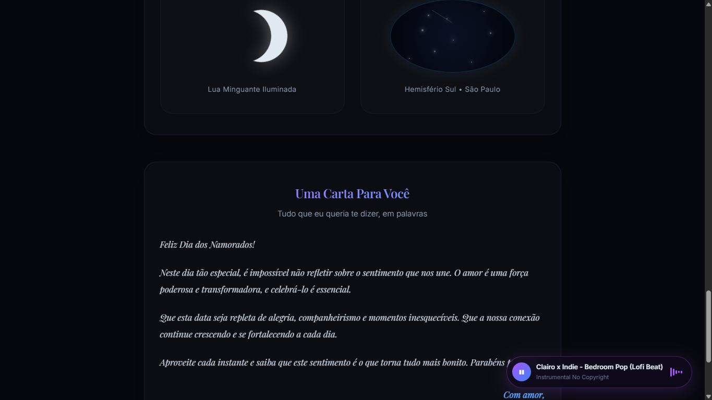
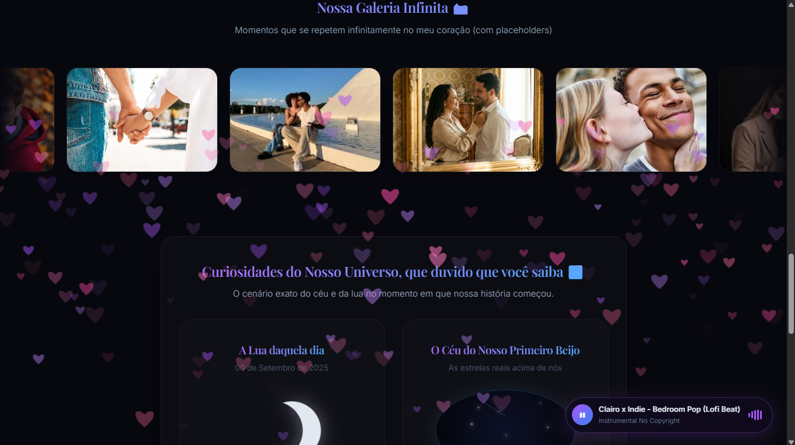

# 💜 Portfólio do Amor

> Uma page interativa desenvolvida em HTML, CSS e JavaScript para celebrar o Dia dos Namorados através de animações, música e elementos visuais personalizados.


---

## 🎬 Demonstração

Caso queira visualizar todas as animações e interações do projeto, assista ao vídeo de demonstração:

🔗 https://drive.google.com/file/d/1A1fOSzel0nS0qix-B8IeLGmz8U7y9xGT/view?usp=sharing

---

## ✨ Funcionalidades

- 💜 Splash Screen animada;
- 🎵 Player de música integrado;
- ⏳ Contador em tempo real;
- 🖼 Carrossel de imagens;
- 🔍 Lightbox para fotos;
- 📝 Timeline personalizada;
- 💌 Mensagens aleatórias;
- 💜 Chuva de corações utilizando Canvas API;
- 📸 Galeria infinita;
- 🌌 Seção Cosmos;
- 📖 Carta animada;
- 📱 Layout responsivo.

---

## 📸 Preview

### Tela de Entrada



### Contador em Tempo Real



### Carrossel de Fotos



### Timeline Interativa



### Botão de Mensagens



### Carta de Amor



### Efeito de Chuva de Corações



## 🛠 Tecnologias Utilizadas

- HTML5
- CSS3
- JavaScript
- Canvas API
- Intersection Observer API
- Flexbox
- CSS Grid

---

## 📚 Conceitos Aplicados

- Manipulação do DOM;
- Eventos;
- setInterval();
- requestAnimationFrame();
- Canvas API;
- Intersection Observer;
- Responsividade;
- Animações CSS;
- Glassmorphism;
- UI/UX.

---

## 🚀 Como Executar

Clone o repositório:

```bash
git clone https://github.com/devmoraria/love-portfolio.git
```

Abra o arquivo:

```text
index.html
```

Ou utilize a extensão **Live Server** do VS Code.

---

## 📂 Estrutura do Projeto

```text
📦 projeto
│
├── assets/
├── index.html
├── style.css
├── favicon.png
├── clairo-lofi-beat.mp3
└── README.md
```

---

## 🎯 Objetivo

Criar uma experiência interativa e visualmente agradável utilizando apenas tecnologias web nativas, explorando animações, manipulação do DOM e efeitos visuais avançados.

---

## 👨‍💻 Autor

Code crafted with love devmoraria 💜
